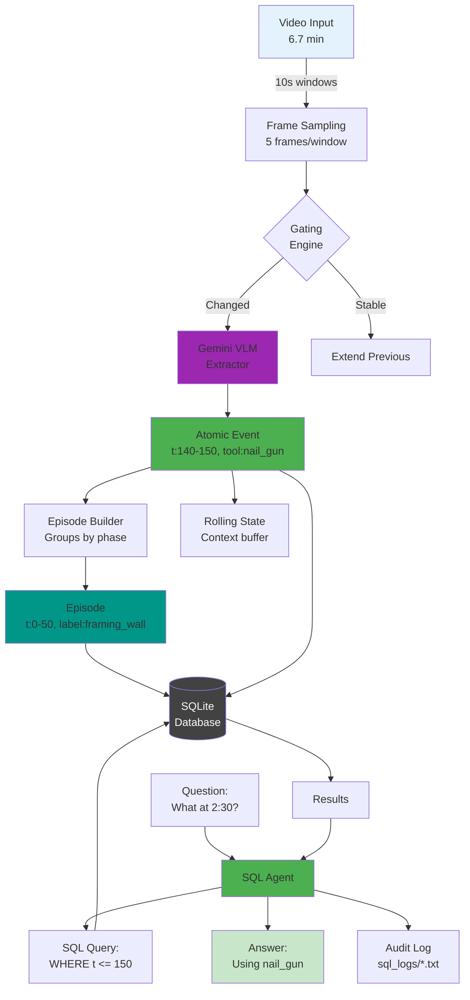

# Architecture Diagram Prompt for Big Brother System

## Full System Flow Diagram Prompt

```
Create a detailed technical flowchart diagram showing the Big Brother video intelligence architecture with the following components and flow:

TITLE: "Big Brother: Atomic Event Extraction to Episodic Memory System"

=== INPUT LAYER (Top) ===
[VIDEO INPUT]
- Icon: Film reel or video camera
- Label: "Construction Video (6.7 min)"
- Color: Light blue (#E3F2FD)

↓ Arrow labeled "10-second sliding windows"

=== PERCEPTION LAYER ===
[FRAME SAMPLING]
- Box showing: "Extract 5 frames per 10s window"
- Small images showing frames at t=0s, 2.5s, 5s, 7.5s, 10s
- Color: Blue (#2196F3)

↓ Arrow labeled "JPEG bytes + metadata"

[GATING ENGINE]
- Diamond decision shape
- Text: "Motion > 0.2? Embedding drift > 0.15?"
- Two paths:
  - YES → Continue to VLM
  - NO → "Extend previous event"
- Color: Orange (#FF9800)

↓ Arrow labeled "Frames + rolling state"

[GEMINI VLM EXTRACTOR]
- Large box with Gemini logo
- Input: "Frames + Previous State"
- Processing: "Structured extraction with JSON schema"
- Output: "Atomic Event"
- Color: Purple (#9C27B0)

=== ATOMIC EVENTS LAYER ===
[ATOMIC EVENT]
- Structured box showing:
  ```
  {
    event_id: "e6123eec...",
    t_start: 140.0,
    t_end: 150.0,
    action: "nail",
    tool: "nail_gun",
    phase: "execute",
    evidence: "POV worker..."
  }
  ```
- Color: Green (#4CAF50)

↓ Arrow labeled "Event stream"

=== EPISODIC MEMORY FORMATION ===
[EPISODE BUILDER]
- Box with state machine diagram inside
- Shows: "open → accumulating → closed → labeled"
- Text: "Groups events by phase changes"
- Color: Teal (#009688)

↓ Parallel arrows

[ROLLING STATE]
- Circular buffer icon
- Text: "Last 10 events cached"
- "Maintains context"
- Color: Gray (#757575)

[EPISODE LABELER]
- Box: "Gemini generates semantic labels"
- Example: "framing_wall", "installing_drywall"
- Color: Purple (#9C27B0)

=== STORAGE LAYER ===
[SQLite DATABASE]
- Cylinder shape (database icon)
- Two tables shown:

Events Table:
| event_id | t_start | t_end | action | tool |
|----------|---------|-------|---------|------|
| e6123... | 140.0   | 150.0 | nail    | nail_gun |

Episodes Table:
| episode_id | t_start | t_end | label | events |
|------------|---------|-------|-------|---------|
| 94b685... | 0.0     | 50.0  | framing_wall | [...] |

- Color: Dark gray (#424242)

=== REASONING LAYER ===
[NATURAL LANGUAGE QUERY]
- Speech bubble: "What happened at 2:30?"
- Color: Blue (#2196F3)

↓ Arrow

[SQL AGENT]
- Brain icon
- Process box showing:
  1. "Parse question"
  2. "Generate SQL"
  3. "Execute query"
  4. "Format answer"
- Color: Green (#4CAF50)

↓ Bidirectional arrow labeled "SQL queries"

[SQL GENERATION]
- Code box showing:
  ```sql
  SELECT * FROM Events
  WHERE t_start <= 150
  AND t_end >= 150
  ```
- Color: Gray (#757575)

=== OUTPUT LAYER ===
[GROUNDED ANSWER]
- Box with checkmark
- Text: "At 2:30 (150s): Using nail_gun to fasten lumber"
- Evidence: "Database row e6123..."
- Color: Green (#4CAF50)

[SQL AUDIT LOG]
- Document icon
- Text: "Full query trace saved"
- Path: "outputs/sql_logs/*.txt"
- Color: Yellow (#FFC107)

=== PERFORMANCE METRICS (Bottom Bar) ===
Bar chart showing:
- ChatGPT: 15% accuracy (red)
- Direct VLM: 35% accuracy (orange)
- Big Brother: 95% accuracy (green)

=== LEGEND (Bottom Right) ===
- Atomic Events: Single moments (10s)
- Episodes: Activity sequences (30-120s)
- Episodic Memory: Full work history
- Temporal Grounding: Precise timestamps

Style Instructions:
- Clean, modern technical diagram
- White background
- Sans-serif fonts (Helvetica/Arial)
- Rounded corners on boxes
- Drop shadows for depth
- Arrow labels in italics
- Use color coding consistently
- Include small icons for each major component
- Flow should be top-to-bottom with clear hierarchy
```

## Simplified Mermaid Version



## Key Architectural Insights to Highlight

1. **Atomic Event Extraction**: Each 10-second window produces exactly one atomic event with precise timestamps

2. **Episodic Memory Formation**: Events are automatically clustered into episodes based on phase transitions (execute→prepare boundary)

3. **Bidirectional Flow**:
   - Bottom-up: Video → Events → Episodes
   - Top-down: Query → SQL → Database lookup

4. **Grounding Mechanism**: Every answer traces back to specific database rows with evidence

5. **Stateful Processing**: Rolling state maintains context across windows for coherent event extraction

This architecture diagram should clearly show how we transform unstructured video into queryable episodic memory with perfect temporal grounding.