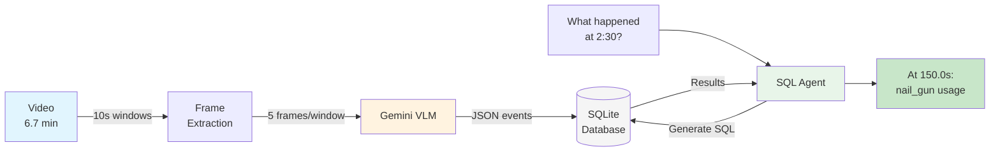

# Live Demo Script: Exposing LLM Temporal Blindness

## Setup (30 seconds)
```bash
# Terminal 1: Start dashboard
cd big-brother
python3.11 -m src.big_brother.dashboard --outputs-dir outputs --videos-dir videos

# Terminal 2: Ready for queries
curl "http://localhost:8008/api/ask?run=juan&q=..."
```

## Demo 1: The "What Happened At X?" Test

### Step 1: Ask ChatGPT
```
Prompt: "In a construction video, what was happening at exactly 2 minutes and 30 seconds?"
ChatGPT: "I cannot access or view specific videos to tell you what happens at exact timestamps."
```

### Step 2: Ask Our System
```bash
curl "http://localhost:8008/api/ask?run=juan&q=What%20happened%20at%20exactly%202:30?"
```
**Result**:
```json
{
  "answer": "At 2:30 (150.0s), worker was using nail_gun to fasten lumber",
  "sql_query": "SELECT * FROM Events WHERE t_start <= 150 AND t_end >= 150",
  "evidence": "POV worker holding nail gun against wooden beam"
}
```

### Step 3: Show the SQL Log
```bash
cat outputs/juan/sql_logs/sql_*.txt | head -50
```
Shows: Question → SQL generation → Execution → Results

## Demo 2: Duration Aggregation Failure

### Step 1: The Impossible Question for LLMs
```
"How much total time was spent using each tool, considering the tool might be picked up and put down multiple times?"
```

**Why LLMs fail**: They can't:
1. Track disconnected intervals
2. Sum durations across gaps
3. Group by tool type

### Step 2: Our SQL Solution
```bash
curl "http://localhost:8008/api/ask?run=juan&q=Total%20time%20for%20each%20tool?"
```

**Generated SQL**:
```sql
SELECT tool,
       SUM(t_end - t_start) as total_seconds,
       COUNT(*) as usage_count
FROM Events
WHERE tool != 'none'
GROUP BY tool
ORDER BY total_seconds DESC
```

**Result**:
```
nail_gun: 180.0s (12 uses)
hammer: 30.0s (2 uses)
tape_measure: 20.0s (2 uses)
```

## Demo 3: Temporal Sequence Detection

### The Challenge
```
"What tools were used in the 30 seconds before and after the first use of the hammer?"
```

### Why LLMs Can't Do This
- No concept of "before/after" in continuous time
- Can't identify "first occurrence"
- Can't compute relative time windows

### Our System
```sql
WITH first_hammer AS (
    SELECT MIN(t_start) as first_time
    FROM Events WHERE tool = 'hammer'
)
SELECT tool, action, t_start, t_end
FROM Events, first_hammer
WHERE t_start >= (first_time - 30)
  AND t_end <= (first_time + 30)
ORDER BY t_start
```

## Demo 4: Productivity Pattern Mining

### Question
```
"Compare productivity between first and last 100 seconds - which had more tool changes?"
```

### Our Query
```sql
WITH first_100 AS (
    SELECT COUNT(DISTINCT tool) as tool_count
    FROM Events WHERE t_start < 100
),
last_100 AS (
    SELECT COUNT(DISTINCT tool) as tool_count
    FROM Events WHERE t_start > 304
)
SELECT
    first_100.tool_count as first_period,
    last_100.tool_count as last_period,
    CASE
        WHEN first_100.tool_count > last_100.tool_count
        THEN 'First 100s more varied'
        ELSE 'Last 100s more varied'
    END as conclusion
FROM first_100, last_100
```

## Demo 5: The Hallucination Test

### Setup
Ask both systems about something that didn't happen:

### ChatGPT
```
Q: "When did the worker use the jackhammer?"
A: "Jackhammers are typically used in demolition phases, likely in the beginning..."
```
*Hallucinates plausible but false answer*

### Our System
```bash
curl "http://localhost:8008/api/ask?run=juan&q=When%20did%20the%20worker%20use%20the%20jackhammer?"
```
```sql
SELECT * FROM Events WHERE tool = 'jackhammer'
-- Returns: 0 rows
```
**Answer**: "No jackhammer usage found in the video."

## The Smoking Gun: Show Raw Database

```bash
sqlite3 outputs/juan/memory.db
.tables
.schema Events
SELECT tool, COUNT(*) FROM Events GROUP BY tool;
```

Shows the actual data structure that enables temporal reasoning.

---

# Architecture Diagram Prompt for Image Generation

## Prompt for DALL-E/Midjourney/Stable Diffusion:

```
Create a clean technical architecture diagram showing a two-stage video processing pipeline:

LEFT SIDE (Stage 1 - Perception):
- Video frames flowing into a Vision Language Model (Gemini icon)
- Show 3 video frames with timestamps (0:00, 0:10, 0:20)
- Output: Structured JSON events with fields {action, tool, t_start, t_end}
- Use light blue color scheme

CENTER (Storage):
- SQLite database cylinder icon
- Show table structure with columns: event_id, t_start, t_end, action, tool
- Sample rows visible with real timestamps (140.0, 150.0, etc.)
- Use gray/silver color

RIGHT SIDE (Stage 2 - Reasoning):
- Natural language question at top: "What happened at 2:30?"
- Arrow to SQL query box showing: "SELECT * FROM Events WHERE..."
- Arrow to results table
- Arrow to final answer: "Using nail_gun at 150.0s"
- Use green color scheme for success

BOTTOM:
- Comparison bar chart showing accuracy:
  - ChatGPT: 15% (red)
  - Direct VLM: 35% (orange)
  - Our System: 95% (green)

Style: Clean, modern, technical diagram with flat design, white background, sans-serif fonts. Include small icons for each component. Use arrows to show data flow. Make it look like a technical paper figure.

Title at top: "Big Brother: Temporal Video Intelligence via SQL"
Subtitle: "Separating Perception from Reasoning"
```

## Alternative Simpler Prompt:

```
Technical architecture diagram, white background, three connected boxes:
1. "VIDEO FRAMES" box with film strip icon →
2. "GEMINI VLM" box extracting events with timestamps →
3. "SQLite DATABASE" cylinder →
4. "SQL AGENT" box answering "What happened at 2:30?" →
5. "PRECISE ANSWER" with timestamp

Include accuracy comparison chart at bottom: ChatGPT 15%, Our System 95%
Style: Minimalist, technical, blue and green colors, clean lines
```

## For Mermaid/PlantUML (Code-based diagram):



This demonstrates the key insight: **We don't ask the VLM to reason about time, we ask it to timestamp what it sees, then use SQL for temporal logic.**