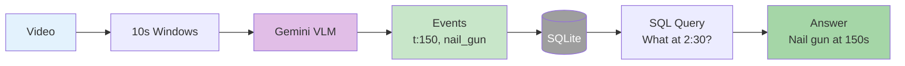

# Simplified Architecture Diagram - Big Brother System

## Clean Left-to-Right Flow Diagram Prompt

```
Create a clean, minimalist technical architecture diagram with strictly left-to-right flow:

TITLE: "Big Brother: Video to Queryable Memory"

=== FLOW (Left to Right) ===

[VIDEO] → [WINDOWS] → [GEMINI] → [EVENTS] → [SQLite] → [SQL AGENT] → [ANSWER]

Details for each component:

1. VIDEO (leftmost)
   - Simple video icon
   - Label: "Construction Video"
   - Light blue box

2. WINDOWS
   - Stack of frames icon
   - Label: "10-sec Windows"
   - Show: "5 frames each"

3. GEMINI
   - Gemini logo
   - Label: "Extract Actions"
   - Purple box

4. EVENTS
   - JSON structure icon
   - Show mini example:
     {t: 150, tool: nail_gun, action: nail}
   - Green box

5. SQLite
   - Database cylinder
   - Label: "Event Storage"
   - Gray

6. SQL AGENT
   - Brain/query icon
   - Label: "Temporal Query"
   - Show: "What at 2:30?"

7. ANSWER (rightmost)
   - Checkmark icon
   - Label: "Grounded Answer"
   - Show: "Nail gun at 150s"
   - Green box

Use clean arrows → between each component.
Single horizontal line, no branching.
White background.
Sans-serif font.
Flat design, no shadows.
Minimal colors: blue, purple, gray, green only.
No performance metrics.
No legend.
No additional text or explanations.
```

## Even Simpler Version for DALL-E

```
Minimalist technical diagram, pure white background, single horizontal flow:
VIDEO → EXTRACT → DATABASE → QUERY → ANSWER

Show construction video transforming into timestamped events in database, then SQL query "What at 2:30?" returning precise answer.

Style: Ultra-clean, flat design, left-to-right only, tech company aesthetic
```

## Mermaid Code Version (Simplest)



## Key Simplifications from Previous Version

1. **Single horizontal flow** - No vertical branching or parallel paths
2. **No performance metrics** - Removed accuracy comparisons
3. **No legend** - Self-explanatory icons and labels
4. **Minimal detail** - Just the core transformation: Video → Events → Queries
5. **Clean aesthetics** - Flat design, limited color palette
6. **No episode layer** - Focus only on atomic events to keep it simple

This creates a clear story: We turn video into a database of timestamped events, then use SQL to answer temporal questions with precision.